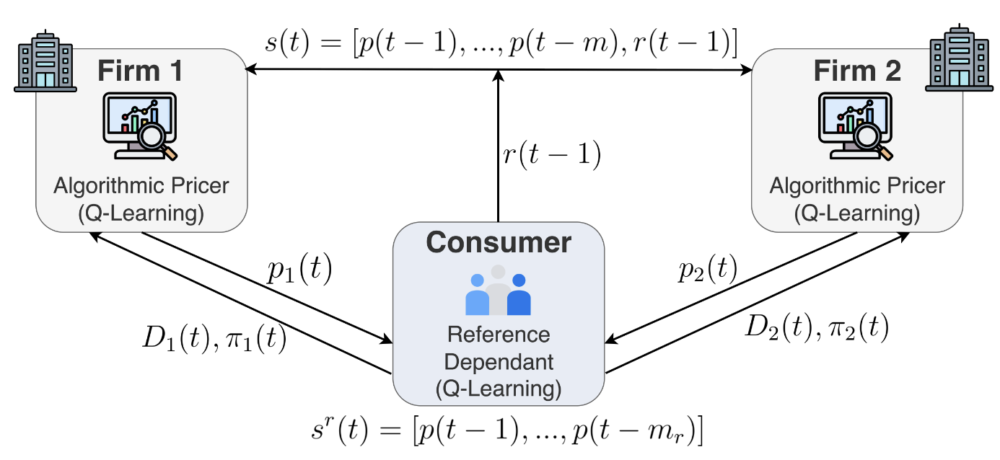

# Algorithmic Collusion Replication (Reference Dependence)

This repository contains simulation code for reference-dependent demand and Q-learning pricing dynamics.

## Model Overview



The setup uses two Q-learning firms interacting with a reference-dependent consumer-side process, consistent with the project design.

## Project Structure

- `main.py`: clean experiment launcher with CLI options
- `input/init.py`: core model/environment and economic primitives
- `input/qlearning.py`: firm learning loop, convergence checks, and cycle detection
- `input/qlearning_reference.py`: consumer reference-price Q-learning agent
- `input/ConvResults*.py`: experiment runners and result saving logic
- `input/visualization.py`: plotting utilities for saved experiment results
- `simulation.py`: standalone comparative plotting script

## Running Experiments

Use `main.py` with CLI flags (no manual editing required).

### Basic usage

```bash
python main.py --experiment gamma_only
```

### Experiment choices

- `trial_test`
- `alpha_beta`
- `gamma_lambda`
- `loss_aversion`
- `gamma_only`
- `mu_only`

### Common reference toggle (default: true)

```bash
python main.py --experiment gamma_only --common-reference true
python main.py --experiment gamma_only --common-reference false
```

### Demand type toggle (default: reference)

Use this for experiments that support demand-switching (`alpha_beta`, `gamma_lambda`, `gamma_only`):

```bash
python main.py --experiment gamma_lambda --demand-type reference
python main.py --experiment gamma_lambda --demand-type misspecification
```

### Choose output root at runtime

```bash
python main.py --experiment gamma_only --output-root "/Users/neda/Documents/MyCleanResults"
```

You can combine options:

```bash
python main.py --experiment gamma_lambda --common-reference false --output-root "/Users/neda/Documents/MyCleanResults"
```

## Outputs

Experiments write outputs under:

- `<output-root>/<experiment_subfolder>/...`

Default output root in `main.py`:

- `/Users/neda/Desktop/UBC/PHD/research_term_4/Rerun`

If `../Results/experiments` already exists as a normal directory, `main.py` will:

1. Move it to a timestamped backup folder.
2. Redirect future writes to the selected `--output-root`.

Typical outputs include:

- `config.csv`
- `session_summaries.csv`
- `cycle_statistics.csv`
- `session_details.npz`
- heatmap figures under `Figures/`

## Current defaults in `main.py`

- `num_sessions = 200`
- all `np.linspace(..., 30)` grids use 30 points
- `common_reference = true` unless you pass `--common-reference false`
- `demand_type = reference` unless you pass `--demand-type misspecification`
- `output_root = /Users/neda/Desktop/UBC/PHD/research_term_4/Rerun`

## Requirements

Install dependencies from:

```bash
pip install -r requirements.txt
```

## Acknowledgments

- This project originally started from: [matteocourthoud/Algorithmic-Collusion-Replication](https://github.com/matteocourthoud/Algorithmic-Collusion-Replication)
- Current implementation and extensions are substantially customized for this repository.
- Conceptual setup is based on your referenced paper: [AER article page](https://www.jstor.org/stable/26966472)
